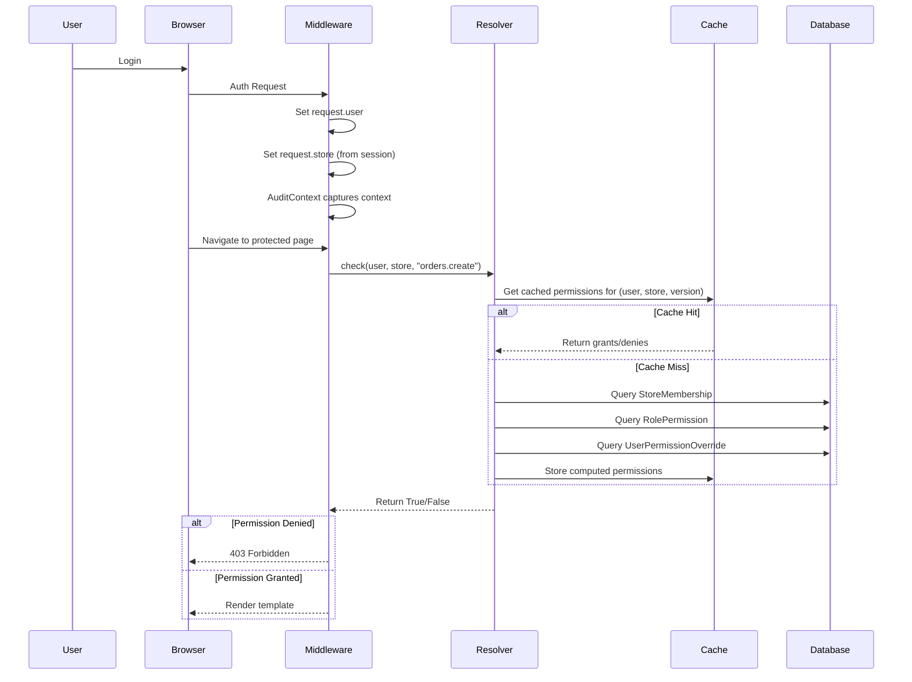
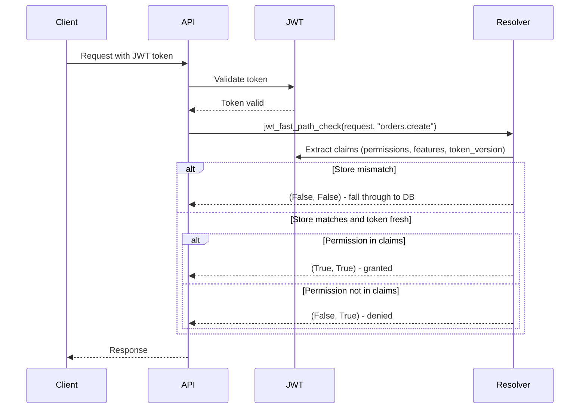

# Role and Permission System Documentation

## Table of Contents
1. [Overview](#overview)
2. [Architecture Components](#architecture-components)
3. [Authentication and Login Flow](#authentication-and-login-flow)
4. [Permission Resolution (5-Layer Flow)](#permission-resolution-5-layer-flow)
5. [Subscription Plans](#subscription-plans)
6. [Complete Authorization Flow](#complete-authorization-flow)
7. [Usage Examples](#usage-examples)
8. [Caching Strategy](#caching-strategy)
9. [Audit Logging](#audit-logging)

---

## Overview

The Social Commerce CRM implements a sophisticated **Role-Based Access Control (RBAC)** system with:

- **Multi-tenancy support** (users can belong to multiple stores)
- **Subscription-based feature gating**
- **5-layer permission evaluation**
- **Object-level authorization**
- **JWT fast-path optimization**
- **Comprehensive audit logging**

---

## Architecture Components

### Core Models

#### 1. **Resource** ([`models.py:46-81`](apps/permissions/models.py#L46-L81))
Represents entities the system protects (customers, products, orders, etc.).

```python
Resource {
    code: str           # e.g., 'customers', 'products'
    name: str
    category: str       # e.g., 'core', 'catalog', 'sales'
    actions: list       # ['view', 'create', 'update', 'delete', ...]
}
```

#### 2. **Permission** ([`models.py:86-132`](apps/permissions/models.py#L86-L132))
Combines Resource + Action. Code format: `<resource>.<action>`

```python
Permission {
    code: str           # e.g., 'customers.view', 'orders.create'
    resource: FK(Resource)
    action: str         # view|create|update|delete|export|import|approve|assign|manage
    is_system: bool     # System permissions cannot be deleted
}
```

#### 3. **Role** ([`models.py:137-207`](apps/permissions/models.py#L137-L207))
Bundles permissions together.

```python
Role {
    name: str
    slug: str
    level: int          # Hierarchy level (100=Owner, 80=Admin, ...)
    store: FK(Store)    # NULL for system roles, set for custom
    is_system: bool
    inherits_from: FK(Role)  # Optional parent role
}

# System Roles (seeded by RolesSeeder):
# - Store Owner (level 100) - Full access
# - Admin (level 80) - All except billing ownership transfer
# - Manager (level 60) - Day-to-day operations
# - Sales Agent (level 40) - Manage own pipeline
# - Customer Support (level 35) - Read+reply on customer/orders
# - Inventory Manager (level 40) - Stock and warehouses
# - Marketing Executive (level 40) - Campaigns and promos
# - Accountant (level 40) - Orders and reports
# - Viewer (level 20) - Read-only access
```

#### 4. **RolePermission** ([`models.py:212-251`](apps/permissions/models.py#L212-L251))
Links Role to Permission with a modifier.

```python
RolePermission {
    role: FK(Role)
    permission: FK(Permission)
    modifier: str      # 'grant' | 'deny' | 'default'
}

# DENY always beats GRANT to prevent privilege escalation
```

#### 5. **StoreMembership** ([`models.py:256-316`](apps/permissions/models.py#L256-L316))
Links User → Store → Role.

```python
StoreMembership {
    user: FK(User)
    store: FK(Store)
    role: FK(Role)
    is_active: bool
    joined_at: datetime
    expires_at: datetime (optional)
    invited_by: FK(User)
}
```

#### 6. **UserPermissionOverride** ([`models.py:321-384`](apps/permissions/models.py#L321-L384))
User-specific grant/deny that overrides role permissions.

```python
UserPermissionOverride {
    user: FK(User)
    store: FK(Store)    # NULL = all stores
    permission: FK(Permission)
    is_granted: bool    # True = grant, False = DENY (absolute)
    expires_at: datetime (optional)
}
```

#### 7. **Feature & SubscriptionPlan** ([`models.py:389-497`](apps/permissions/models.py#L389-L497))
Subscription-based feature gating.

```python
Feature {
    code: str           # e.g., 'marketing_campaigns', 'multi_warehouse'
    name: str
    category: str
}

SubscriptionPlan {
    name: str
    slug: str           # 'starter' | 'growth' | 'professional' | 'enterprise'
    price: Decimal
    max_users: int
    max_stores: int
    max_products: int
    max_orders_per_month: int
    max_warehouses: int
}

PlanFeature {
    plan: FK(SubscriptionPlan)
    feature: FK(Feature)
    limit_value: int    # NULL = unlimited
}
```

---

## Authentication and Login Flow

### Step 1: User Login

When a user logs in:

1. **Template-based login** via `LoginView`
2. **JWT-based login** via `RBACTokenObtainPairSerializer` ([`serializers_rbac.py:104-130`](apps/accounts/serializers_rbac.py#L104-L130))

### Step 2: Current Store Resolution

After authentication, the system determines the current store:

```python
# From context_processors.py:23-53
def current_store(request):
    # 1. Check session for stored store_id
    store_id = request.session.get("current_store_id")
    
    # 2. Load user's accessible stores
    user_stores = Store.objects.filter(
        Q(owners=user) | Q(managers=user) | Q(staff=user)
    ).distinct()
    
    # 3. Return selected store or first available
    return store_from_session or user_stores.first()
```

### Step 3: Store Set on Request

The selected store is available as:
- `request.store` (for middleware/views)
- `current_store` (in templates)

### Step 4: JWT Claims (Optional Optimization)

When using JWT authentication, the token embeds RBAC claims ([`serializers_rbac.py:49-101`](apps/accounts/serializers_rbac.py#L49-L101)):

```python
JWT Token Claims:
{
    "user_id": str,
    "email": str,
    "is_superuser": bool,
    "stores": list[str],           # All store IDs user is member of
    "current_store_id": str,       # Most recent active store
    "permissions": list[str],      # Permission codes for current_store
    "features": list[str],         # Feature codes for current_store plan
    "token_version": int           # For cache invalidation
}
```

---

## Permission Resolution (5-Layer Flow)

The [`PermissionResolver`](apps/permissions/resolver.py#L46-L237) evaluates permissions in 5 layers:

### Layer 1: Subscription Plan Access

**Question:** Does the store's plan have this feature?

```python
def check_feature(user, store, code: str) -> bool:
    # Check subscription exists and is active
    subscription = Subscription.objects.get(store=store)
    if not subscription.is_active():
        return False
    
    # Check plan has feature
    return PlanFeature.objects.filter(
        plan=subscription.plan,
        feature__code=code
    ).exists()
```

**Usage:**
```python
@feature_required("marketing_campaigns")
def campaign_list(request):
    ...
```

### Layer 2: Store-Level Permissions

**Question:** Is the user an active member of this store?

```python
# From resolver.py:176-181
memberships = StoreMembership.objects.filter(
    user=user, 
    store=store, 
    is_active=True
)

if not memberships.exists():
    return set(), set()  # No permissions
```

### Layer 3: Role-Based Permissions

**Question:** What permissions do the user's roles grant?

```python
# From resolver.py:183-198
rps = RolePermission.objects.filter(
    role_id__in=memberships
).select_related("permission")

grants = set()
denies = set()

for rp in rps:
    if rp.modifier == "grant":
        grants.add(rp.permission.code)
    elif rp.modifier == "deny":
        denies.add(rp.permission.code)
```

### Layer 4: User-Specific Overrides

**Question:** Are there any user-specific grants/denies?

```python
# From resolver.py:199-216
overrides = UserPermissionOverride.objects.filter(
    Q(user=user),
    Q(store__in=[store, NULL]),  # Store-specific or global
    Q(expires_at__isnull=True) | Q(expires_at__gt=now)
)

for override in overrides:
    if override.is_granted:
        grants.add(override.permission.code)
    else:
        denies.add(override.permission.code)
        grants.discard(override.permission.code)  # DENY is absolute
```

### Layer 5: Object-Level Authorization

**Question:** For this specific object instance, does the user have permission?

```python
# From resolver.py:219-237
def _check_object(user, store, code: str, obj) -> bool:
    checker = get_object_checker(resource_code)
    
    if checker is None:
        return True  # No checker = pass-through
    
    return checker(user, store, code, obj)
```

### Resolution Summary

```python
def check(user, store, code: str, obj=None) -> bool:
    # 1. Superuser bypass
    if user.is_superuser:
        return True
    
    # 2. Load cached grants/denies
    grants, denies = _load_grants_and_denies(user, store)
    
    # 3. Check denies (short-circuit)
    if code in denies:
        return False
    
    # 4. Check grants
    if code in grants:
        if obj is not None:
            return _check_object(user, store, code, obj)
        return True
    
    # 5. Default deny
    return False
```

---

## Subscription Plans

### Plan Tiers

| Plan | Price | Users | Stores | Products | Key Features |
|------|-------|-------|--------|----------|--------------|
| **Starter** | $19/mo | 3 | 1 | 500 | Customer management, Basic reports |
| **Growth** | $49/mo | 10 | 3 | 5,000 | + Inventory, Marketing campaigns, Team management |
| **Professional** | $99/mo | 25 | 10 | 25,000 | + Multi-warehouse, API, Facebook/WhatsApp integration |
| **Enterprise** | $299/mo | 999 | 999 | Unlimited | + SSO, Audit export |

### Feature Codes

From [`constants.py:95-108`](apps/permissions/constants.py#L95-L108):

```python
DEFAULT_FEATURES = (
    "customer_management",
    "basic_reports",
    "inventory_management",
    "marketing_campaigns",
    "advanced_reports",
    "team_management",
    "multi_warehouse",
    "api_access",
    "facebook_integration",
    "whatsapp_integration",
    "sso",
    "audit_export",
)
```

### Subscription Model

```python
Subscription {
    store: OneToOneField(Store)
    plan: FK(SubscriptionPlan)
    status: str          # 'trialing' | 'active' | 'past_due' | 'canceled' | 'expired'
    starts_at: datetime
    ends_at: datetime
    trial_ends_at: datetime
    current_period_start: datetime
    current_period_end: datetime
    stripe_customer_id: str
    stripe_subscription_id: str
}

SubscriptionEvent {
    subscription: FK(Subscription)
    event_type: str      # 'created' | 'renewed' | 'upgraded' | 'canceled' | 'payment_failed'
    occurred_at: datetime
    metadata: JSON
    actor: FK(User)
}
```

### Limit Enforcement

From [`services.py:116-124`](apps/permissions/services.py#L116-L124):

```python
def assert_within_plan_limit(store, limit_attr: str, current_value: int):
    """Raise PlanLimitExceeded if current_value exceeds plan cap."""
    sub = store.subscription
    if not sub or not sub.is_active():
        raise PlanLimitExceeded(limit_attr, current_value, 0)
    
    cap = getattr(sub.plan, limit_attr, None)
    if cap and current_value >= cap:
        raise PlanLimitExceeded(limit_attr, current_value, cap)
```

---

## Complete Authorization Flow

### For Template Views



### For API Requests with JWT



---

## Usage Examples

### Function Views with Decorators

```python
from apps.permissions.decorators import permission_required, feature_required

@permission_required("orders.create")
def create_order(request):
    # User must have 'orders.create' permission in current store
    ...

@permission_required("orders.update", obj_kwarg="order_id")
def order_detail(request, order_id):
    # Includes object-level check
    order = get_object_or_404(Order, pk=order_id)
    ...

@feature_required("marketing_campaigns")
def campaign_list(request):
    # Store's plan must have 'marketing_campaigns' feature
    ...
```

### Class-Based Views with Mixins

```python
from apps.permissions.mixins import PermissionRequiredMixin, FeatureRequiredMixin

class OrderCreateView(PermissionRequiredMixin, CreateView):
    permission_required = "orders.create"
    template_name = "orders/create.html"

class CampaignListView(FeatureRequiredMixin, ListView):
    required_feature = "marketing_campaigns"
    template_name = "campaigns/list.html"
```

### DRF ViewSets with Permission Classes

```python
from rest_framework import viewsets
from apps.permissions.permissions import HasPermission, HasFeature, IsStoreMember

class OrderViewSet(viewsets.ModelViewSet):
    permission_classes = [IsStoreMember, HasPermission]
    permission_code = "orders.view"
    object_permission_code = "orders.update"

    def get_permissions(self):
        if self.action == "create":
            return [IsStoreMember(), HasPermission.with_code("orders.create")]
        return super().get_permissions()
```

### Template Tags

```django



    <a href="/orders/create/">Create Order</a>



    <div class="campaign-banner">Upgrade to access campaigns</div>



    <button>Edit Order</button>



    
        <div class="order-actions">...</div>
    

```

### Direct Permission Checks

```python
from apps.permissions.services import user_has_permission, user_has_feature

# In business logic
if user_has_permission(request.user, store, "orders.delete"):
    order.delete()

if user_has_feature(request.user, store, "advanced_reports"):
    generate_advanced_report()
```

---

## Caching Strategy

### Version-Stamp Pattern

The system uses Redis caching with automatic invalidation via version stamps.

### Cache Keys

```python
# User permission cache
user_perm_key(user_id, store_id, version)
# Format: "rbac:user:{uid}:s:{sid}:v:{version}"

# User feature cache
user_feature_key(user_id, store_id, version, plan_version)
# Format: "rbac:user:{uid}:s:{sid}:v:{version}:pv:{plan_version}"

# Version stamps
user_version_key = f"rbac:user:{user_id}:version"
store_plan_version_key = f"rbac:store:{store_id}:plan_version"
```

### Cache Invalidation

From [`signals.py:82-141`](apps/permissions/signals.py#L82-L141):

```python
# When user's roles/memberships/overrides change:
def _on_membership_change(sender, instance, **kwargs):
    transaction.on_commit(lambda: bump_user_version(instance.user_id))

def _on_override_change(sender, instance, **kwargs):
    transaction.on_commit(lambda: bump_user_version(instance.user_id))

# When store's subscription/plan changes:
def _on_subscription_change(sender, instance, **kwargs):
    transaction.on_commit(lambda: bump_store_plan_version(instance.store_id))

def _on_plan_change(sender, instance, **kwargs):
    # Affects all stores on this plan
    for store in Subscription.objects.filter(plan=instance):
        bump_store_plan_version(store.id)
```

### TTL

Default cache TTL: 15 minutes (900 seconds)

---

## Audit Logging

All RBAC mutations are logged to the [`AuditLog`](apps/permissions/models.py#L590-L648) model.

### Logged Events

From [`constants.py:114-130`](apps/permissions/constants.py#L114-L130):

```python
# Role events
AUDIT_ROLE_CREATE = "role.create"
AUDIT_ROLE_UPDATE = "role.update"
AUDIT_ROLE_DELETE = "role.delete"

# RolePermission events
AUDIT_ROLE_PERMISSION_CREATE = "role_permission.create"
AUDIT_ROLE_PERMISSION_UPDATE = "role_permission.update"
AUDIT_ROLE_PERMISSION_DELETE = "role_permission.delete"

# StoreMembership events
AUDIT_MEMBERSHIP_CREATE = "membership.create"
AUDIT_MEMBERSHIP_UPDATE = "membership.update"
AUDIT_MEMBERSHIP_DELETE = "membership.delete"

# UserPermissionOverride events
AUDIT_OVERRIDE_CREATE = "permission_override.create"
AUDIT_OVERRIDE_UPDATE = "permission_override.update"
AUDIT_OVERRIDE_DELETE = "permission_override.delete"

# Subscription events
AUDIT_SUBSCRIPTION_CREATE = "subscription.create"
AUDIT_SUBSCRIPTION_UPDATE = "subscription.update"
AUDIT_PLAN_CREATE = "plan.create"
AUDIT_PLAN_UPDATE = "plan.update"
```

### Audit Record Structure

```python
AuditLog {
    actor: FK(User)           # Who made the change
    store: FK(Store)          # Which store was affected
    action: str               # Event type (e.g., "role.create")
    target_type: str          # Model name (e.g., "Role")
    target_id: str            # ID of affected object
    before: JSON              # State before change
    after: JSON               # State after change
    ip_address: IP
    user_agent: str
    request_id: str           # For tracing
    created_at: datetime
}
```

### Context Capture

From [`middleware.py:50-80`](apps/permissions/middleware.py#L50-L80):

```python
class AuditContextMiddleware:
    def __call__(self, request):
        ctx = {
            "user": request.user,
            "store_id": request.store.id if request.store else None,
            "ip": request.META.get("REMOTE_ADDR"),
            "ua": request.META.get("HTTP_USER_AGENT")[:512],
            "request_id": request.META.get("HTTP_X_REQUEST_ID") or uuid.uuid4().hex,
        }
        # Context available to signal handlers
        set_request_context(**ctx)
```

---

## Key Files Reference

| File | Purpose |
|------|---------|
| [`apps/permissions/models.py`](apps/permissions/models.py) | Core RBAC models |
| [`apps/permissions/resolver.py`](apps/permissions/resolver.py) | Permission decision engine |
| [`apps/permissions/constants.py`](apps/permissions/constants.py) | Stable identifiers |
| [`apps/permissions/registry.py`](apps/permissions/registry.py) | Resource/Permission definitions |
| [`apps/permissions/services.py`](apps/permissions/services.py) | Business logic helpers |
| [`apps/permissions/decorators.py`](apps/permissions/decorators.py) | Function view decorators |
| [`apps/permissions/mixins.py`](apps/permissions/mixins.py) | CBV mixins |
| [`apps/permissions/permissions.py`](apps/permissions/permissions.py) | DRF permission classes |
| [`apps/permissions/middleware.py`](apps/permissions/middleware.py) | Audit & HTMX middleware |
| [`apps/permissions/signals.py`](apps/permissions/signals.py) | Cache invalidation & audit |
| [`apps/permissions/cache.py`](apps/permissions/cache.py) | Redis caching utilities |
| [`apps/permissions/context_processors.py`](apps/permissions/context_processors.py) | Template context |
| [`apps/permissions/templatetags/rbac.py`](apps/permissions/templatetags/rbac.py) | Template tags |
| [`apps/accounts/jwt_rbac.py`](apps/accounts/jwt_rbac.py) | JWT fast-path checks |
| [`apps/accounts/serializers_rbac.py`](apps/accounts/serializers_rbac.py) | RBAC-aware JWT serializer |
| [`apps/common/context_processors.py`](apps/common/context_processors.py) | Current store resolution |

---

## Quick Reference: Permission Codes

From [`registry.py:36-145`](apps/permissions/registry.py#L36-L145):

### Core Resources
- `dashboard.view`
- `customers.{view,create,update,delete,export,import}`
- `customer_groups.{view,create,update,delete}`

### Catalog Resources
- `products.{view,create,update,delete,export,import}`
- `categories.{view,create,update,delete}`
- `inventory.{view,update,export}`
- `warehouses.{view,create,update,delete}`

### Sales Resources
- `orders.{view,create,update,delete,approve,export}`
- `returns.{view,create,update,approve}`
- `couriers.{view,create,update,delete,assign}`

### Marketing Resources
- `campaigns.{view,create,update,delete,approve}`
- `promo_codes.{view,create,update,delete}`

### Analytics Resources
- `reports.{view,create,export}`

### Team Resources
- `employees.{view,create,update,delete,assign}`
- `roles.{view,create,update,delete,assign}`
- `permissions.{view,create,update,delete}`

### Platform Resources
- `integrations.{view,create,update,delete}`
- `settings.{view,update}`

---

This documentation provides a comprehensive guide to the Role and Permission system. For implementation details, refer to the linked source files.
